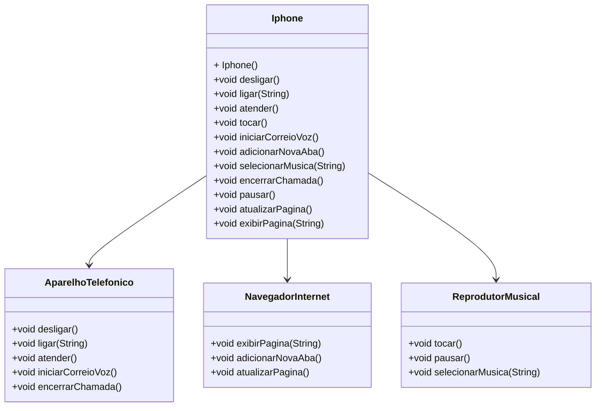

```mermaid
classDiagram
class Iphone {
  + Iphone() 
  +void desligar() 
  +void ligar(String) 
  +void atender() 
  +void tocar() 
  +void iniciarCorreioVoz() 
  +void adicionarNovaAba() 
  +void selecionarMusica(String) 
  +void encerrarChamada() 
  +void pausar() 
  +void atualizarPagina() 
  +void exibirPagina(String)
}
class AparelhoTelefonico {
  +void desligar() 
  +void ligar(String) 
  +void atender() 
  +void iniciarCorreioVoz() 
  +void encerrarChamada() 
}
class NavegadorInternet {
  +void exibirPagina(String) 
  +void adicionarNovaAba() 
  +void atualizarPagina() 
}
class ReprodutorMusical {
  +void tocar() 
  +void pausar() 
  +void selecionarMusica(String) 
}

Iphone  -->  AparelhoTelefonico 
Iphone  -->  NavegadorInternet 
Iphone  -->  ReprodutorMusical 
```